```{r setup, include=FALSE}
knitr::opts_chunk$set(echo = FALSE, fig.align = "center")
```

## Архитектура модели нейронной сети

Для решения задачи построения модели экстраполяции значений коэффициентов ряда для приемных устройств ЦАР была выбрана архитектура полносвязной нейронной сети прямого распространения. На вход модели подаются известные реальные значения коэффициентов для физических приемников ЦАР, рассчитанных на основе принятого распределения интенсивности отраженного сигнала от сканируемой области. Входные данные обозначены как вектор значений $C_{input} = (C_{-K},\ C_{-K+1},\ \dots, \ C_{-1},\ C_{0}, \dots, \ C_{K})$ для физических элементов системы ЦАР c индексами в пределах $[-K,\ K]$, где $K$ - количество реальных физических приемных устройств одномерной системы в одну из двух сторон от центрального детектора одномерной ЦАР. Выход нейросетевой модели $C_out$ составляет вектор предсказываемых значений коэффициентов виртуальной приемной системы большего размера в окне экстраполяции $[-M,\ M]$, где $M$ - соотвественно количество применых устройств виртуальной одномерной приемной системы в одну сторону.

Полносвязная нейросетевая модель состоит из соединенных в скрытые слои линейные нейроны с нелинейной функцией активации, порождающих нелинейные преобразования над входными данными по мере прямого распространения информации от входов модели к выходу. Каждый слой нейронной сети обладает взвешивающими предыдущие входы весами для определения итогового значения линейной комбинации признаков. Веса полносвязной нейронной сети будем обозначать как вектор $\Omega$ матриц $W^{j}_{(R,C)}$ соответствующих весам $j$-го слоя:

$$
\Omega = \left(W^{I}_{(2K+1,\ P_1)}, W^{II}_{(P_1,\ P_2)}, \dots, W^{L}_{(P_{(L-1)}, 2M+1)} \right)
$$

В каждой матрице число строк $R$ совпадает с числом входов, а число столбцов $C$ совпадает с числом нейронов в данном скрытом слое. Последний слой нейронной сети обозначим как $L$. Число входов и выходов из нейронной сети, или размерность отображения зависит от прикладной задачи, в которой мы уже определились с количеством входов $2K + 1$ и выходов $2M + 1$ соответственно.

Тогда будем считать, что модель нейронной сети прямого распространения ставит задачу отображения входных данных одной размерности через преобразования на основе матриц весов в выходные данные другой размерности по следующему правилу:

$$
\hat{C}_{out} = f(C_{input}|\ \Omega),
$$
где $\hat{C}_{out}$ - оцененные с помощью модели значения искомой зависимости между $C_{input}$ и $C_{out}$.

Схематично архитектура построенной модели выглядит следующим образом (рис.1а). 

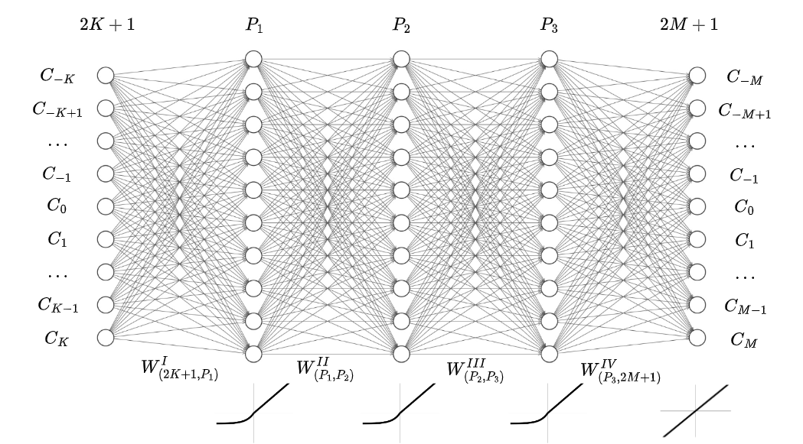


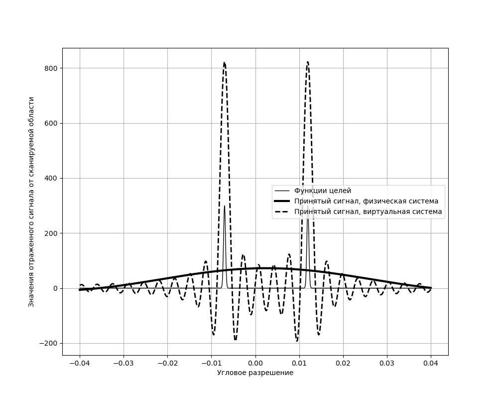


## Обучение нейронной сети прямого распространения

Обучающая выборка для построения модели нейронной сети состояла из матрицы прецедентов $X_{train}$, начальных данных коэффициентов реальных приемных устройств физической ЦАР количество которых для каждой записи составляло $2 * K + 1$. Матрица прецедентов $X_{train}$ выглядит следующим образом:

$$
X_{train} = \begin{pmatrix}
C_{(1, -K)} & C_{(1, -K + 1)} & C_{(1, -K + 2)} & \dots & C_{(1, K)} \\
C_{(2, -K)} & C_{(2, -K + 1)} & C_{(2, -K + 2)} & \dots & C_{(2, K)} \\
C_{(3, -K)} & C_{(3, -K + 1)} & C_{(3, -K + 2)} & \dots & C_{(3, K)} \\
\dots & \dots & \dots & \dots & \dots \\
C_{(N, -K)} & C_{(N, -K + 1)} & C_{(N, -K + 2)} & \dots & C_{(N, K)} \\
\end{pmatrix}.
$$

Строки матрицы - это записи, которые являются примерами приема датчиками одного сгенерированного сигнала с двумя целями, не резрешимыми по критерию Рэлея. Столбцы - это коэффициенты каждого приемного устройства при различных целях.

Правильные ответы для обучения модели представлены в виде матрицы откликов $Y_{train}$, которая состояла из желаемых значений коэффициентов виртуальной ЦАР с большим числом приемных устройств $2 * M + 1$.

$$
Y_{train} = \begin{pmatrix}
C_{(1, -M)} & C_{(1, -M + 1)} & C_{(1, -M + 2)} & \dots & C_{(1, M)} \\
C_{(2, -M)} & C_{(2, -M + 1)} & C_{(2, -M + 2)} & \dots & C_{(2, M)} \\
C_{(3, -M)} & C_{(3, -M + 1)} & C_{(3, -M + 2)} & \dots & C_{(3, M)} \\
\dots & \dots & \dots & \dots & \dots \\
C_{(N, -M)} & C_{(N, -M + 1)} & C_{(N, -M + 2)} & \dots & C_{(N, M)} \\
\end{pmatrix}.
$$

При обучении модели мы преследуем цель расширить общее число виртуальных устройств с помощью экстраполяции значений коэффициентов датчиков в обе стороны от центра ЦАР. Схематично, это можно выразить следующим образом:


Выборка была сформирована на основе генерации случайных пар целей в пределах окна отсутсвия их разрешения в принятом сигнале $U(\alpha)$ по критерию Релея. Распределения коэффициентов реальной ЦАР в матрице прецедентов $X_{train}$ при подстановке в расчет итогового принятого сигнала не давала возможности различить в исследуемом угловом разрешении различные цели. В матрице откликов мы имеем желаемые коэффициенты виртуальной ЦАР, полученные путем рассчета коэффицентов приемных устройств с большим их числом в системе по зависимости, показанной выше.

## Полученные результаты

На основе сгенерированной выборки с $N = 40000$ наборов значений коэффициентов принятого сигнала для моделируемой физической системы приемных устройств и желаемых для данного распределения сигналов, не разрешимых данной системой по критерию Рэлея, коэффициентов принятого сигнала для системы виртуальных устройств была обучена модель полносвязной нейронной сети прямого распространения с тремя скрытыми слоями по $P_i = 500,\ i=1, 2, 3$ нейронов в каждом. В рамках данной задачи тестировалась физическая система с $K = 20$ реальных приемных устройств в одну сторону от центра одномерной ЦАР и виртуальной системой с $M = 400$ приемных устройств, что определяет количество входных и выходных значений в одном наборе выборки данных.

Обучение модели полносвязной нейронной сети прямого распространения происходило на случайно сгенерированных выборках с применением метода оптимизации *Adam* со стандартными гиперпараметрами $\beta_1 = 0.9$ и $\beta_2 = 0.999$, начальной скоростью обучения $lr = 0.001$. Для оптимизации параметров модели применялся пакетный метод оптимизации с размером пакета наборов $batch\_size = 400$.В качестве минимизируемого функционала качества выступала среднеквадратическая ошибка $MSE$. Обучение до плато на кривой обучения по метрике среднеквадратической ошибки заняло ориентировочно 2000 эпох. Полученные результаты для обученной модели представлены ниже на рисунках.

Целевой метрикой для решения задачи можно считать разрешимость выявляемых системой обнаружения положений максимумов амплитуд принятого сигнала $U(\alpha)$ по критерию Рэлея, а также среднеквадратическую ошибку экстраполированных значений коэффициентов приемных устройств $C_n \in \mathbb{C},\ n = -M, -M+1, \dots M$ в действительной и комплексной области по сравнению с желаемыми значениями коэффициентов вирутальной системы для конкретной моделируемой функции целей на валидационной отложенной выборке.

В первом эксперименте были взяты симметричные (чётные) цели относительно начала координат в выбранном угловом разрешении, не позволяющем распознать данные цели реальной физической системой. С помощью обученной модели экстраполяции значений коэффициентов приемных устройств получаем разрешимую картину принятого сигнала (рис.1а). По графикам значений коэффициентов применых устройств наблюдаем слабую ошибку экстраполяции для первых приемных устройств  и ухудшение качества при переходе через минимум экстраполируемой зависимости в действительной области (рис.1б).

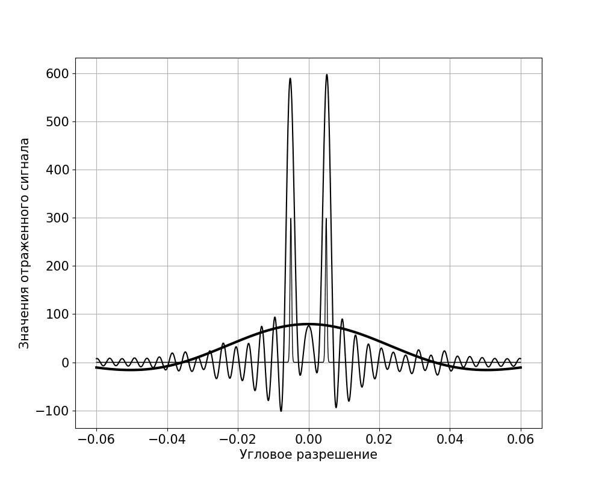 

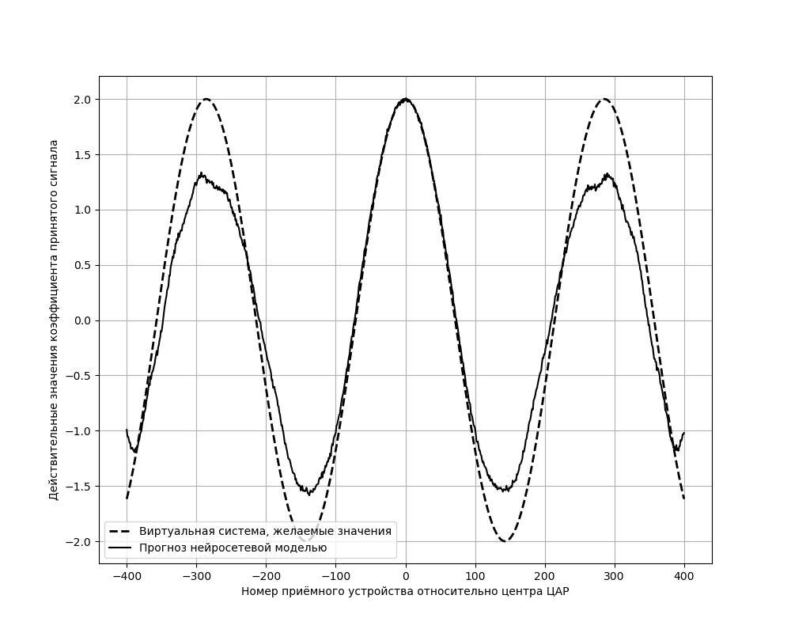 

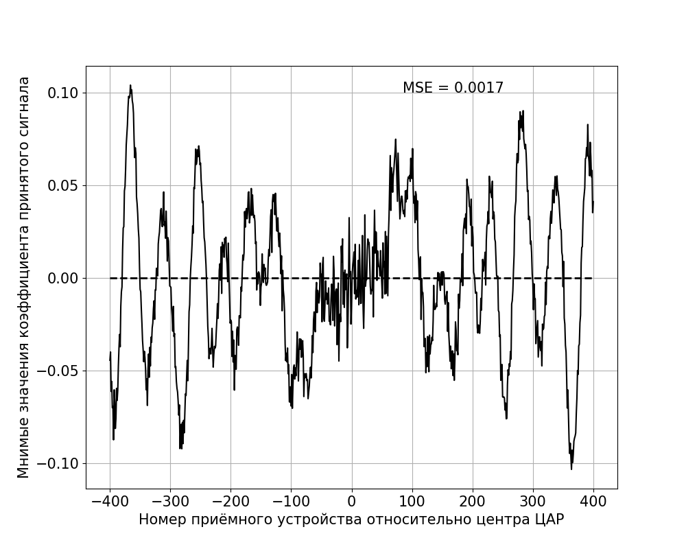 

Сплошная тонкая линия - функции моделируемых целей; сплошная жирная линия - прием сигнала и коэффициенты реальной физической моделируемой системы; штриховая линия - идеальные (целевые) значения вирутальной системы обнаружения с большим числом приемных устройств; сплошная линия - прогнозирование моделью нейронной сети.

Отметим для симметричных целей высокую точность выявления целей и маленькую ошибку экстраполяции на ближайшие 200 виртуальных устройств.

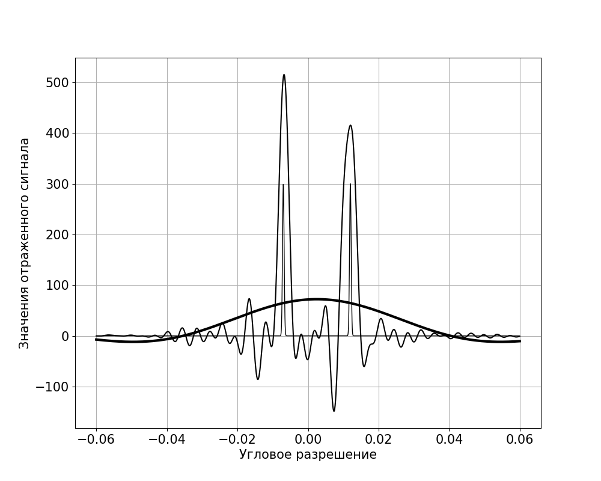

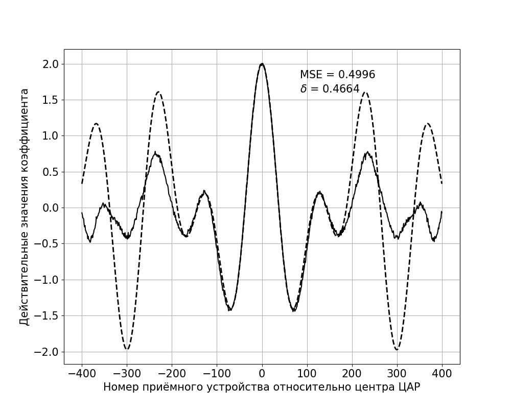

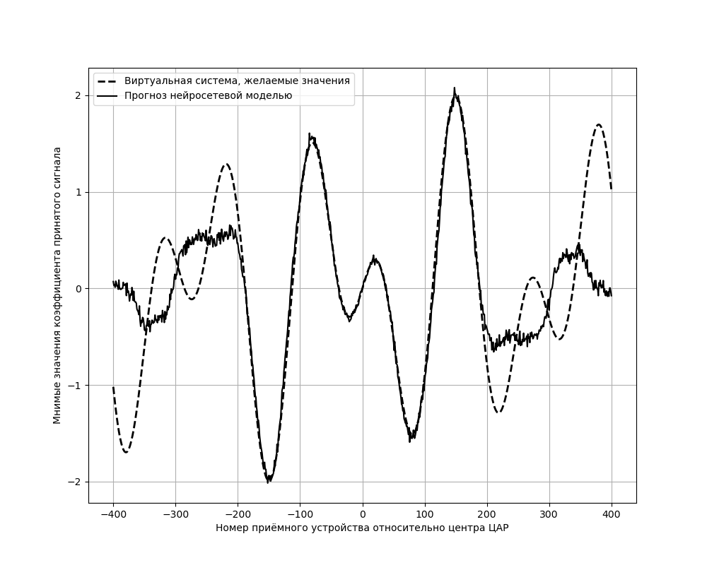

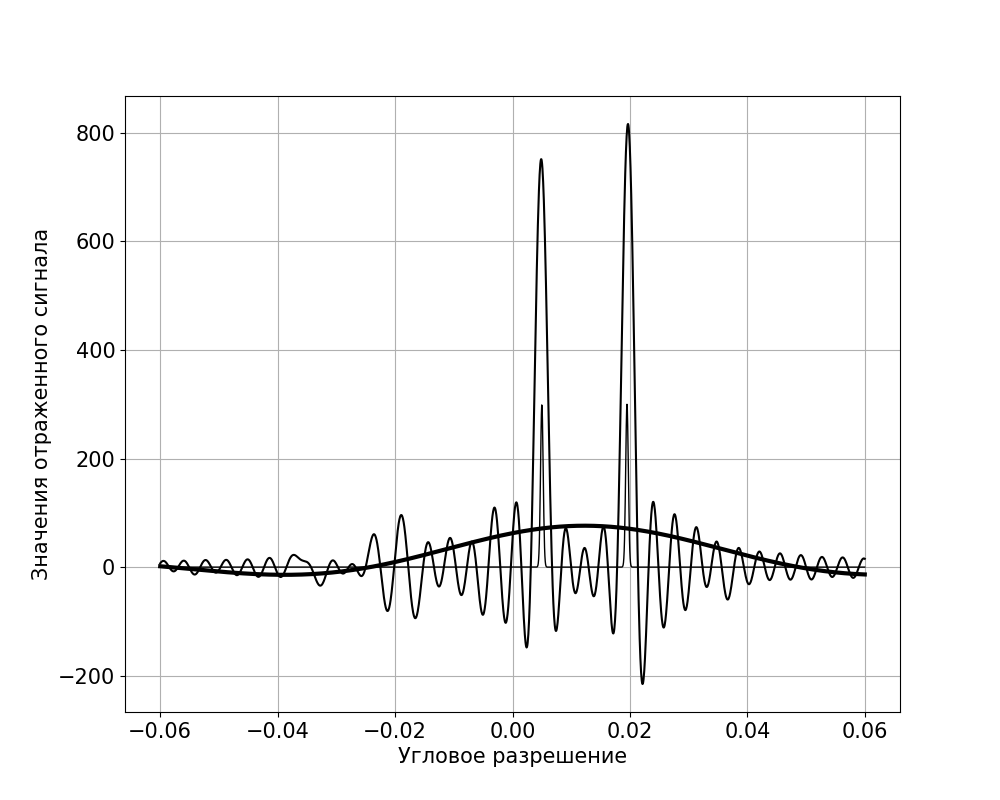

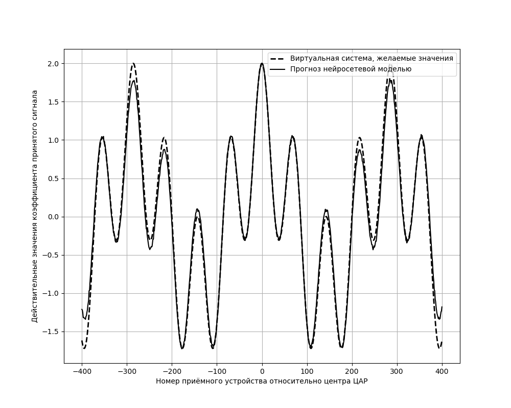

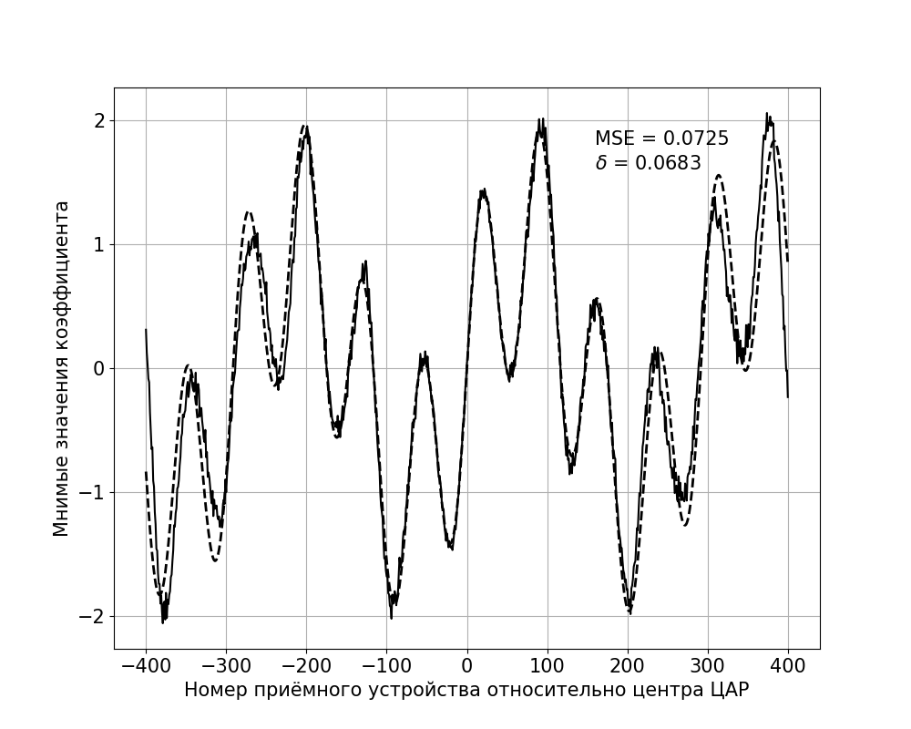
